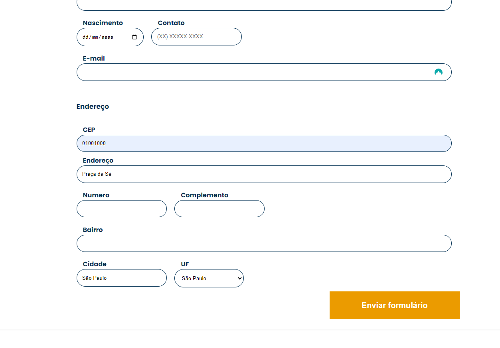

# JavaScript: Consumindo e tratando dados de uma API
Repositório do treinamento "JavaScript: Consumindo e tratando dados de uma API" da Alura Cursos Online.

Neste treinamento, ensina sobre consumo e tratamento de dados de uma API. Inicialmente, o treinamento abordou o funcionamento do fluxo de eventos no JavaScript, incluindo Event Loop, Task Queue e Call Stack. Em seguida, focou no consumo de APIs utilizando Fetch API e Promises, e no tratamento dos dados retornados. Também foi ensinado como manipular o DOM para interagir com o usuário, como captar e autopreencher dados em um formulário com base na resposta da API.

No projeto prático, foi demonstrado o uso do formulário de cadastro da AluraBooks. O campo de CEP foi testado com um CEP válido e inválido, mostrando como a aplicação preenche automaticamente os dados corretos e como lida com erros, exibindo mensagens apropriadas para o usuário.

---

##
